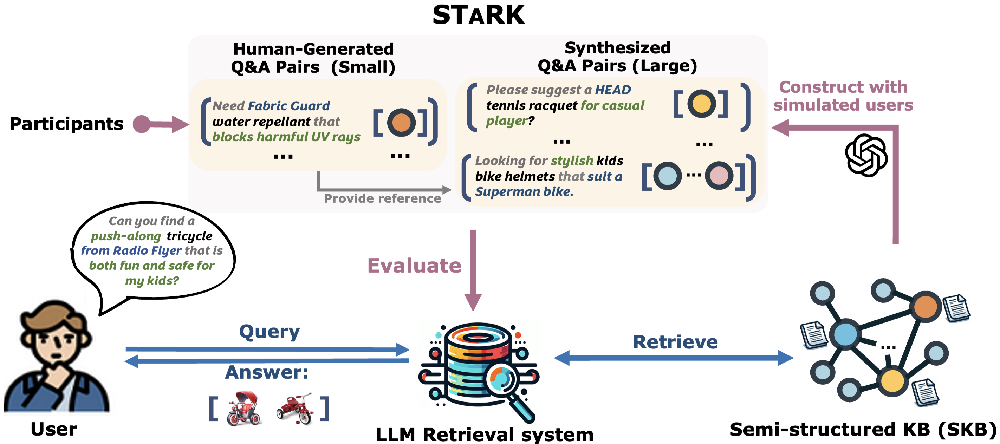
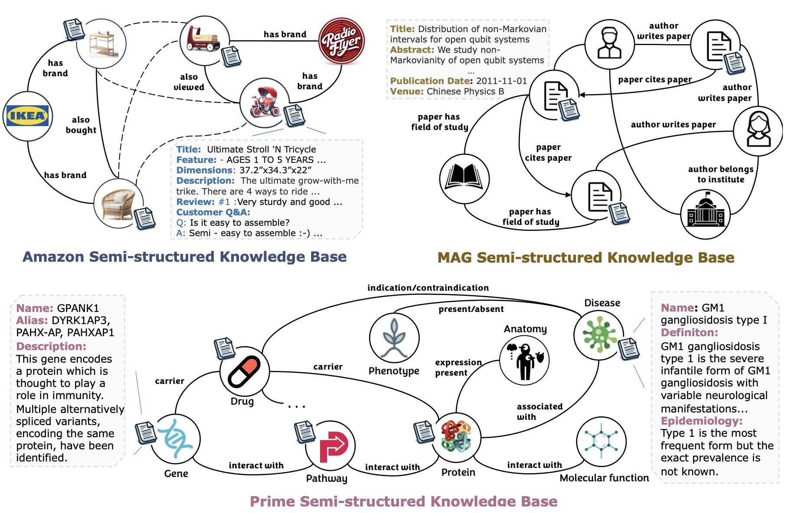
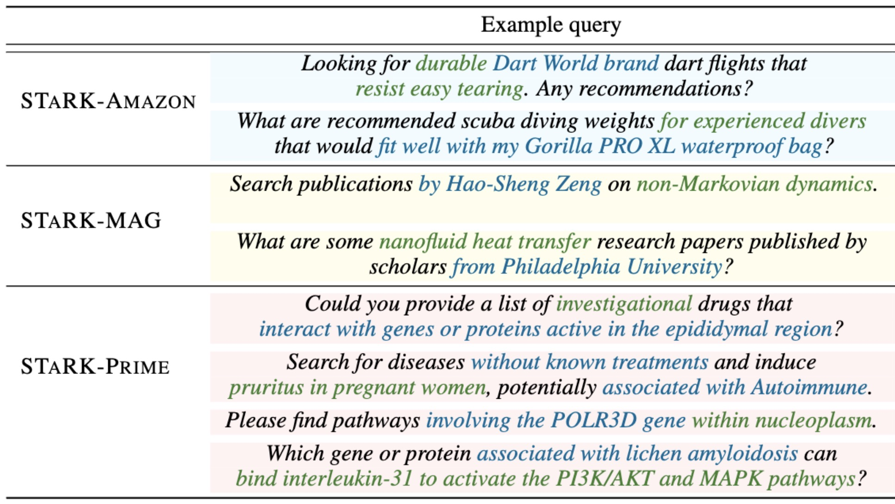

<div align="center">
<figure class="center-figure"> </figure>
</div>

<h1 align="left">
    STaRK: Benchmarking LLM Retrieval on Textual and Relational Knowledge Bases
</h1>

<div align="left">

[](https://stark.stanford.edu/)
[](https://huggingface.co/datasets/snap-stanford/stark)
[](https://stark.stanford.edu/skb_explorer.html)
[](https://huggingface.co/spaces/snap-stanford/stark-leaderboard)

[](https://arxiv.org/abs/2404.13207)
[](https://pypi.org/project/stark-qa/) 
[](https://stark.stanford.edu/docs/index.html)
[](https://www.linkedin.com/posts/leskovec_reduce-llm-hallucinations-with-rag-over-textual-activity-7190745116339302401-da4n?utm_source=share&utm_medium=member_desktop) 
[](https://twitter.com/ShirleyYXWu/status/1784970920383402433) 
[](https://opensource.org/licenses/MIT)
</div>


## NEWS
- **[Oct 2024]** [Leaderboard](https://huggingface.co/spaces/snap-stanford/stark-leaderboard): We construct the official leaderboard on Hunggingface and we are calling for submissions!
- **[Oct 2024]** [Camera-ready paper](https://github.com/snap-stanford/stark/blob/main/media/stark.pdf) is out! We add multiple retrieval models including BM25, Colbertv2, GritLM.
- **[Sep 2024]** STaRK is accepted to 2024 NeurIPS Dataset & Benchmark Track!
- **[Jun 2024]** We make our benchmark as a pip package [stark-qa](https://pypi.org/project/stark-qa/). You can directly load the data from the package now!
- **[Jun 2024]** We migrate our data to [Hugging Face](https://huggingface.co/datasets/snap-stanford/stark)! You don't need to change anything, the data will be automatically downloaded.
- **[May 2024]** We have augmented our benchmark with three high-quality human-generated query datasets which are open to access. See more details in our [updated arxiv](https://arxiv.org/abs/2404.13207)! 
- **[May 9th 2024]** We release [STaRK SKB Explorer](https://stark.stanford.edu/skb_explorer.html), an interactive interface for you to explore our knowledge bases!
- **[May 7th 2024]** We present STaRK in the [2024 Stanford Annual Affiliates Meeting](https://forum.stanford.edu/events/2024-annual-affiliates-meeting/day-3-ai-health-and-data-science-applications-workshop) and [2024 Stanford Data Science Conference](https://datascience.stanford.edu/2024-stanford-data-science-conference).
- **[May 5th 2024]** STaRK was reported on [Marketpost](https://www.marktechpost.com/2024/05/01/researchers-from-stanford-and-amazon-developed-stark-a-large-scale-semi-structure-retrieval-ai-benchmark-on-textual-and-relational-knowledge-bases/) and [智源社区 BAAI](https://hub.baai.ac.cn/paper/6841fd6f-1eca-41c4-a432-5f2d845ac167). Thanks for writing about our work!
- **[Apr 21st 2024]** We release the STaRK benchmark.

## What is STaRK?
STaRK is a large-scale Semi-structured Retrieval Benchmark on Textual and Relational Knowledge bases, covering applications in product search, academic paper search, and biomedicine inquiries.

Featuring diverse, natural-sounding, and practical queries that require context-specific reasoning, STaRK sets a new standard for assessing real-world retrieval systems driven by LLMs and presents significant challenges for future research.


🔥 Check out our [website](https://stark.stanford.edu/) for more overview!
<!-- 
<figure class="center-figure">
    
</figure>


## Why STaRK?
- **Novel Task**: Recently, large language models have demonstrated significant potential on information retrieval tasks. Nevertheless, it remains an open
question how effectively LLMs can handle the complex interplay between textual and relational
requirements in queries.

- **Large-scale and Diverse KBs**: We provide three large-scale knowledge bases across three areas, which are constructed from public sources.

    <figure class="center-figure"> </figure> 

- **Natural-sounding and Practical Queries**: The queries in our benchmark are crafted to incorporate rich relational information and complex textual properties, and closely mirror questions in real-life scenarios, e.g., with flexible query formats and possibly with extra contexts.

    <figure class="center-figure"> </figure>  -->


# Access benchmark data

## 1) Env Setup

### From pip (recommended)
With python >=3.8 and <3.12
```bash
pip install stark-qa
```

### From source
Create a conda env with python >=3.8 and <3.12 and install required packages in `requirements.txt`.
```bash
conda create -n stark python=3.11
conda activate stark
pip install -r requirements.txt
```

## 2) Data loading 

```python
from stark_qa import load_qa, load_skb

dataset_name = 'amazon'

# Load the retrieval dataset
qa_dataset = load_qa(dataset_name)
idx_split = qa_dataset.get_idx_split()

# Load the semi-structured knowledge base
skb = load_skb(dataset_name, download_processed=True, root=None)
```
The root argument for load_skb specifies the location to store SKB data. With default value `None`, the data will be stored in [huggingface cache](https://huggingface.co/docs/datasets/en/cache).


### Data of the Retrieval Task

Question answer pairs for the retrieval task will be automatically downloaded in `data/{dataset}/stark_qa` by default. We provided official split in `data/{dataset}/split`.


### Data of the Knowledge Bases

There are two ways to load the knowledge base data:
- (Recommended) Instant downloading: The knowledge base data of all three benchmark will be **automatically** downloaded and loaded when setting `download_processed=True`. 
- Process data from raw: We also provided all of our preprocessing code for transparency. Therefore, you can process the raw data from scratch via setting `download_processed=False`. In this case, STaRK-PrimeKG takes around 5 minutes to download and load the processed data. STaRK-Amazon and STaRK-MAG may takes around an hour to process from the raw data.

## 3) Evaluation on benchmark

If you are running eval, you may install the following packages:
```bash
pip install llm2vec gritlm bm25
```

- Our evaluation requires embed the node documents into `candidate_emb_dict.pt`, which is a dictionary `node_id -> torch.Tensor`. Query embeddings will be automatically generated if not available. You can either run the following the python script to download query embeddings and document embeddings generated by `text-embedding-ada-002`. (We provide them so you can run on our benchmark right away.)
    ```bash
    python emb_download.py --dataset amazon --emb_dir emb/
    ```
    
    Or you can run the following code to generate the query or document embeddings by yourself. E.g.,
    ```bash
    python emb_generate.py --dataset amazon --mode query --emb_dir emb/ --emb_model text-embedding-ada-002
    ```
    - `dataset`: one of `amazon`, `mag` or `prime`.
    - `mode`: the content to embed, one of `query` or `doc` (node documents).
    - `emb_dir`: the directory to store embeddings.
    - `emb_model`: the LLM name to generate embeddings, such as `text-embedding-ada-002`, `text-embedding-3-large`, , `voyage-large-2-instruct`, `GritLM/GritLM-7B`, `McGill-NLP/LLM2Vec-Meta-Llama-3-8B-Instruct-mntp`
    - See `emb_generate.py` for other arguments.

- Run the python script for evaluation. E.g.,
    ```bash
    python eval.py --dataset amazon --model VSS --emb_dir emb/ --output_dir output/ --emb_model text-embedding-ada-002 --split test --save_pred 
    ```
    
    ```bash
    python eval.py --dataset amazon --model VSS --emb_dir emb/ --output_dir output/ --emb_model GritLM/GritLM-7B --split test-0.1 --save_pred 
    ```

    ```bash
    python eval.py --dataset amazon --model LLMReranker --emb_dir emb/ --output_dir output/ --emb_model text-embedding-ada-002 --split human_generated_eval --llm_model gpt-4-1106-preview --save_pred
    ```

    Key args:
    - `dataset`: the dataset to evaluate on, one of  `amazon`, `mag` or `prime`.
    - `model`: the model to be evaluated, one of `BM25`, `Colbertv2`, `VSS`, `MultiVSS`, `LLMReranker`. 
        - Please specify the name of embedding model with argument `--emb_model`.
        - If you are using `LLMReranker`, please specify the LLM name with argument `--llm_model`.
        - Specify API keys in command line
            ```
            export ANTHROPIC_API_KEY=YOUR_API_KEY
            ```
            or
            ```
            export OPENAI_API_KEY=YOUR_API_KEY
            export OPENAI_ORG=YOUR_ORGANIZATION
            ```
            or 
            ```
            export VOYAGE_API_KEY=YOUR_API_KEY
            ```
    - `emb_dir`: the directory to store embeddings.
    - `split`: the split to evaluate on, one of `train`, `val`, `test`, `test-0.1` (10% random sample), and `human_generated_eval` (to be evaluated on the human generated query dataset).
    - `output_dir`: the directory to store evaluation outputs.
    - `surfix`: Specify when the stored embeddings are in folder `doc{surfix}` or `query{surfix}`, e.g., _no_compact, 


## Reference 

Please consider citing our paper if you use our benchmark or code in your work:
```
@inproceedings{wu24stark,
    title        = {STaRK: Benchmarking LLM Retrieval on Textual and Relational Knowledge Bases},
    author       = {
        Shirley Wu and Shiyu Zhao and 
        Michihiro Yasunaga and Kexin Huang and 
        Kaidi Cao and Qian Huang and 
        Vassilis N. Ioannidis and Karthik Subbian and 
        James Zou and Jure Leskovec
    },
    booktitle    = {NeurIPS Datasets and Benchmarks Track},
    year         = {2024}
}
```
