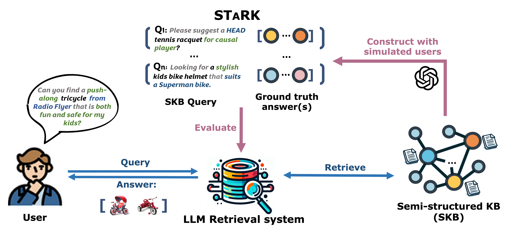

<h1 align="center">
    STaRK: Benchmarking LLM Retrieval on Textual and Relational Knowledge Bases
</h1>


<div align="center">

[](https://arxiv.org/abs/2404.13207)
[](https://github.com/snap-stanford/stark) 
[](https://www.linkedin.com/posts/shirley-wu-bb1751199_knowledgegraphs-informationretrieval-research-activity-7189163931087613952-wJLQ?utm_source=share&utm_medium=member_desktop) 
[](https://opensource.org/licenses/MIT)
</div>

## What is STaRK?
STaRK is a large-scale semi-structure retrieval benchmark on Textual and Relational Knowledge Bases. Given a user query, the task is to extract nodes from the knowledge base that are relevant to the query. 


<figure class="center-figure">
    
</figure>


## Why STaRK?
- **Novel Task**: Recently, large language models have demonstrated significant potential on information retrieval tasks. Nevertheless, it remains an open
question how effectively LLMs can handle the complex interplay between textual and relational
requirements in queries.

- **Large-scale and Diverse KBs**: We provide three large-scale knowledge bases across three areas, which are constructed from public sources.

    <figure class="center-figure"> </figure> 

- **Natural-sounding and Practical Queries**: The queries in our benchmark are crafted to incorporate rich relational information and complex textual properties, and closely mirror questions in real-life scenarios, e.g., with flexible query formats and possibly with extra contexts.

    <figure class="center-figure"> </figure> 


# Access benchmark data

## 1) Env Setup
Create a conda env with python 3.8 and install required packages in `requirements.txt`.
```bash
conda create -n stark python=3.8 
conda activate stark
pip install -r requirements.txt
```

## 2) Data loading 

### Demo: See [`load_dataset.ipynb`](https://github.com/snap-stanford/stark/blob/main/load_dataset.ipynb) for more
```python
from src.benchmarks.get_qa_dataset import get_qa_dataset
from src.benchmarks.get_semistruct import get_semistructured_data

dataset_name = 'amazon'

# Load the retrieval dataset
qa_dataset = get_qa_dataset(dataset_name)
idx_split = qa_dataset.get_idx_split()

# Load the knowledge base
kb = get_semistructured_data(dataset_name, download_processed=True)
```

### Data of the Retrieval Task

Question answer pairs for the retrieval task are locally included in `data/{dataset}/stark_qa`. We provided official split in `data/{dataset}/split`.


### Data of the Knowledge Bases

There are two ways to load the knowledge base data:
- (Recommended) Instant downloading: The knowledge base data of all three benchmark will be **automatically** downloaded and loaded when setting `download_processed=True`. 
- Process data from raw: We also provided all of our preprocessing code for transparency. Therefore, you can process the raw data from scratch via setting `download_processed=False`. In this case, STaRK-PrimeKG takes around 5 minutes to download and load the processed data. STaRK-Amazon and STaRK-MAG may takes around an hour to process from the raw data.

## 3) Evaluation on benchmark
- Our evaluation requires embed the node documents into `candidate_emb_dict.pt`, which is a dictionary `node_id -> torch.Tensor`. Query embeddings will be automatically generated if not available. You can either run the following the python script to download query embeddings and document embeddings generated by `text-embedding-ada-002`. (We provide them so you can run on our benchmark right away.)
    ```bash
    python download_emb.py --dataset amazon --emb_dir emb
    ```
    
    Or you can run the following code to generate the query or document embeddings by yourself. E.g.,
    ```bash
    python generate_emb.py --dataset amazon --mode query --emb_dir emb/ --llm_version text-embedding-ada-002
    ```
    - `dataset`: one of `amazon`, `mag` or `primekg`.
    - `mode`: the content to embed, one of `query` or `doc` (node documents).
    - `emb_dir`: the directory to store embeddings.
    - `llm_version`: the LLM name to generate embeddings, such as `text-embedding-ada-002`, `text-embedding-3-large`.
    - See `generate_emb.py` for other arguments.

- Run the python script for evaluation. E.g.,
    ```bash
    python eval.py --dataset amazon --model VSS --emb_dir emb/ --output_dir output/ --save_pred --llm_version text-embedding-ada-002
    ```

    - `dataset`: the dataset to evaluate on, one of  `amazon`, `mag` or `primekg`.
    - `model`: the model to be evaluated, one of `VSS`, `MultiVSS`, `GPTQA`, `ClaudeQA`. 
        - If you are using `GPTQA` or `ClaudeQA`, please specify API keys at `config/openai_api_key.txt` or `config/claude_api_key.txt`.
        - Please specify the LLM name with argument `--llm_version`.
    - `emb_dir`: the directory to store embeddings.
    - `output_dir`: the directory to store evaluation outputs.


## Reference 

```
@article{wu24stark,
    title        = {STaRK: Benchmarking LLM Retrieval on Textual and Relational Knowledge Bases},
    author       = {
        Shirley Wu and Shiyu Zhao and 
        Michihiro Yasunaga and Kexin Huang and 
        Kaidi Cao and Qian Huang and 
        Vassilis N. Ioannidis and Karthik Subbian and 
        James Zou and Jure Leskovec
    },
    eprinttype   = {arXiv},
    eprint       = {2404.13207},
  year           = {2024}
}
```
